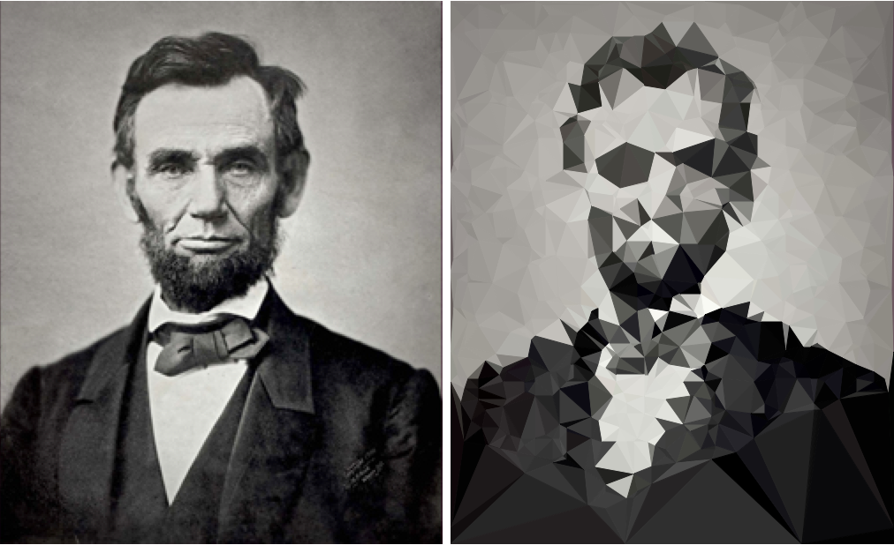

triangulate-image
===

installation
---

* [triangulate-image.min.js](https://raw.githubusercontent.com/snorpey/triangulate-image/master/dist/triangulate-image.min.js) 16kb
* [triangulate-image.js](https://raw.githubusercontent.com/snorpey/triangulate-image/master/dist/triangulate-image.js) 48kb
* [triangulate-image-master.zip](https://github.com/snorpey/triangulate-image/archive/master.zip)

```npm install triangulate-image```

```bower install triangulate-image```

```jspm install triangulate-image```

what is it?
---
a javascript module that converts images to triangular polygons:



how to use it
===

this library can be used in web browsers as well as in node. a simple example:

```javascript
var params = { blur: 110, vertexCount: 700 };
var image = new Image();

image.onload = function () {
	document.body.innerHTML = triangulate(params).fromImage(image).toSVG();
};

image.src = 'lincoln.jpg'
```

as you can see, there are __three__ calls happening:

1. ``triangulate()`` is called with the __triangulation parameters__
2. then ``fromImage()`` is called with the __input__ image as parameter
3. and finally ``toSVG()`` is called to __output__ svg markup.

when using the library, always follow these three steps: _triangulation_, _input_, _output_.

for an exmplanation of all available functions and parameters, see the [reference section](#reference) below.

you can find more examples for both node and brower in the [examples](examples) folder of this repository.

reference
===

* [``triangulate()``](#triangulate)
* input: [``fromImage()``](#fromimage), [``fromImageData()``](#fromimagedata), [``fromBuffer()``](#frombuffer)
* output: [``toDataURL()``](#todataurl), [``toImageData()``](#toimagedata), [``toData()``](#todata), [``toSVG()``](#tosvg), [``toJPGStream()``](#tojpgstream), [``toPNGStream()``](#topngstream), [``toSVGStream()``](#tosvgstream)

triangulate()
---
``triangulate()`` can take the following parameters

```javascript

// the parameters listed are the default params

var triangulationParams = {
	accuracy: 0.7,    // float beteween 0 and 1
	blur: 40,         // positive integer
	vertexCount: 700, // positive integer
	fill: true,       // boolean or string with css color (e.g '#bada55', 'red')
	stroke: true,     // boolean or string with css color (e.g '#bada55', 'red')
	strokeWidth: 0.5, // positive float
	lineJoin: 'miter' // 'miter', 'round', or 'bevel'
};

```

it returns an object containing all __input methods__.

fromImage()
---
``fromImage()`` expects an ``Image`` object as it's only parameter. it returns an object containing all _input methods_.

example:

```javascript
var image = new Image();

image.onload = function () {
	document.body.innerHTML = triangulate().fromImage( image ).toSVG();
};

image.src = 'lincoln.jpg'
```

_please note_: this method is not available in node.
_important_: when using the library in a browser, make sure the image was loaded before triangulating it.

fromImageData()
---
``fromImageData()`` expects an ``ImageData`` object as it's only parameter. it returns an object containing all _input methods_.

example:

```javascript
var canvas = document.createElement( 'canvas' );
var ctx = canvas.getContext( '2d' );

ctx.fillStyle = 'red';
ctx.fillRect( 30, 30, 90, 45 );
ctx.fillStyle = 'green';
ctx.fillRect( 10, 20, 50, 60 );

var imageData = ctx.getImageData( 0, 0, canvas.width, canvas.height );

document.body.innerHTML = triangulate().fromImageData( imageData ).toSVG();
```

fromBuffer()
---
``fromBuffer()`` expects a ``Buffer`` object as it's only parameter. it returns an object containing all _input methods_.

it uses [image#src=buffer](https://github.com/Automattic/node-canvas#imagesrcbuffer) from [node-canvas](https://github.com/Automattic/node-canvas) internally.

example:

```javascript
var fs = require('fs');

fs.readFile( './lincoln.jpg', function ( err, buffer ) {
	if ( err ) { throw err; }
		
	var svgMarkup = triangulate().fromBuffer( buffer ).toSVG();

	fs.writeFile( './lincoln.svg', svgMarkup, function ( err ) {
		if ( err ) { throw err; }
		console.log( 'created an svg file.' );
	} );
} );
```

_please note_: this method is only available in node.

toDataURL()
---
``toDataURL()`` can take the following parameters:

```javascript
var dataUrlParams = {
	dpr: 1                   // positive number, short for devicePixelRatio,
	backgroundColor: 'green' // background color of image. not set: transparent background
};

```

it returns a ``String`` containing the base64-encoded image url.

example:

```javascript
var image = new Image();

image.onload = function () {
	var dataURL = triangulate()
		.fromImage( image )
		.toDataURL();

	document.body.style.background = 'url(' + dataURL + ')';
};

image.src = 'lincoln.jpg'
```

toImageData()
---
``toImageData()`` can take the following parameters:

```javascript
var imageDataParams = {
	dpr: 1                   // positive number, short for devicePixelRatio,
	backgroundColor: 'green' // background color of image. not set: transparent background
};

```

it returns an ``ImageData`` object.

example:

```javascript
var image = new Image();

image.onload = function () {
	var imageData = triangulate()
		.fromImage( image )
		.toImageData();
	
	var canvas = document.createElement( 'canvas' );
	var ctx = canvas.getContext( '2d' );
	ctx.putImageData( imageData, 0, 0 );

	document.body.appendChild( canvas );
};

image.src = 'lincoln.jpg'
```

toSVG()
---
``toSVG()`` does not take any parameters. it returns a ``String`` with svg markup.

example:

```javascript
var params = { blur: 110, vertexCount: 700 };
var image = new Image();

image.onload = function () {
	document.body.innerHTML = triangulate( params ).fromImage( image ).toSVG();
};

image.src = 'lincoln.jpg'
```

toData()
---
``toData()`` does not take any parameters. it returns an ``Array`` with the data for all polygons.

example:

```javascript
var image = new Image();

image.onload = function () {
	console.log( triangulate().fromImage( image ).toData() );
};

image.src = 'lincoln.jpg'
```

toBuffer()
---
``toBuffer()`` can take the following parameters:

```javascript
var bufferParams = {
	format: 'svg' // 'svg', 'pdf' or undefined
};

```

it uses [canvas#tobuffer](https://github.com/Automattic/node-canvas#canvastobuffer) from [node-canvas](https://github.com/Automattic/node-canvas) internally.

it returns a ``Buffer`` object.

example:

```javascript
var fs = require('fs');
fs.readFile( './lincoln.jpg', function ( err, buffer ) {
	if ( err ) { throw err; }
		
	var imageBuffer = triangulate().fromBuffer( buffer ).toBuffer( { format: 'pdf' } );

	fs.writeFile( './lincoln.pdf', imageBuffer, function ( err ) {
		if ( err ) { throw err; }
		console.log( 'created a pdf file.' );
	} );
} );
```

_please note_: this method is only available in node.

toJPGStream()
---
``toJPGStream()`` can take the following parameters:

```javascript
var jpgStreamParams = {
	bufsize: 4096,          // output buffer size in bytes
	quality: 75,            // jpg quality (0-100) default: 75
	progressive: false,     // true for progressive compression
	dpr: 1,                 // positive number, short for devicePixelRatio,
	backgroundColor: '#fff' // btw: there are no transparent backgrounds in jpg.
};

```

it uses [canvas#jpegstream()](https://github.com/Automattic/node-canvas#canvasjpegstream-and-canvassyncjpegstream) from [node-canvas](https://github.com/Automattic/node-canvas) internally.

it returns a ``JPEGStream`` object.

example:

```javascript
var fs = require('fs');
fs.readFile( '.lincoln.jpg', function ( err, buffer ) {
	if ( err ) { throw err; }

	var fileStream = fs.createWriteStream( './triangulatedLincoln.jpg' );
	var jpgStream = triangulate().fromBuffer( buffer ).toJPGStream( { backgroundColor: 'red' } );
	
	jpgStream.on( 'data', function ( chunk ) { fileStream.write( chunk ); } );
	jpgStream.on( 'end', function () { console.log( 'jpg file created.' ); } );
} );
```

_please note_: this method is only available in node.

toJPEGStream()
---
see [``toJPGStream()``](#tojpgstream).

toPNGStream()
---
``toPNGStream()`` can take the following parameters:

```javascript
var jpgStreamParams = {
	dpr: 1,                 // positive number, short for devicePixelRatio,
	backgroundColor: '#fff' // background color of image. not set: transparent background
};

```

it uses [canvas#pngstream()](https://github.com/Automattic/node-canvas#canvaspngstream) from [node-canvas](https://github.com/Automattic/node-canvas) internally.

it returns a ``PNGStream`` object.

example:

```javascript
var fs = require('fs');
fs.readFile( '.lincoln.jpg', function ( err, buffer ) {
	if ( err ) { throw err; }

	var fileStream = fs.createWriteStream( './triangulatedLincoln.png' );
	var pngStream = triangulate().fromBuffer( buffer ).toPNGStream( { backgroundColor: 'blue' } );
	
	pngStream.on( 'data', function ( chunk ) { fileStream.write( chunk ); } );
	pngStream.on( 'end', function () { console.log( 'png file created.' ); } );
} );
```

_please note_: this method is only available in node.

toSVGStream()
---
``toSVGStream()`` can't take any parameters.

it returns a ``ReadableStream`` object.

example:

```javascript
var fs = require('fs');
fs.readFile( '.lincoln.jpg', function ( err, buffer ) {
	if ( err ) { throw err; }

	var svgStream = triangulate().fromBuffer( buffer ).toSVGStream();
	svgStream.pipe( process.stdout );
} );
```

_please note_: this method is only available in node.

in node
---

when used in node, this library has a dependency on the [node-canvas](https://github.com/Automattic/node-canvas) module. node-canvas may require some [extra steps](https://github.com/Automattic/node-canvas#installation) to get it to work on some platforms.

development
===

`npm run build` will build the node-ready and browser-ready versions, which are written to the `dist-node` and `dist` directories.

license
===

[mit](LICENSE)

third party code
---
some parts of the code were taken from the [triangulation image generator](http://jsdo.it/akm2/xoYx) by [akm2](http://codepen.io/akm2) (MIT license).

most of the folder structure and the npm script setup were taken from [nonalnawson](https://github.com/nolanlawson)'s [hello javascript](https://github.com/nolanlawson/hello-javascript) repo (Apache-2.0 license).

dependencies:

* [delaunay js](https://github.com/ironwallaby/delaunay) by [ironwallaby](https://github.com/ironwallaby), public domain
* [canvas-browserify](https://github.com/dominictarr/canvas-browserify) by [dominictarr](https://github.com/dominictarr), MIT license
* [stackblur-canvas](https://github.com/flozz/StackBlur) by [flozz](https://github.com/flozz) and [quasimondo](https://github.com/quasimondo), MIT license


missing somehing?
---

found a bug? missing a feature? are you using this library in an interesting project? take a look at the [issues](./issues), open a pull request and let me know.

most importantly
---

thank you for taking a look at this repo. have a great day :)
