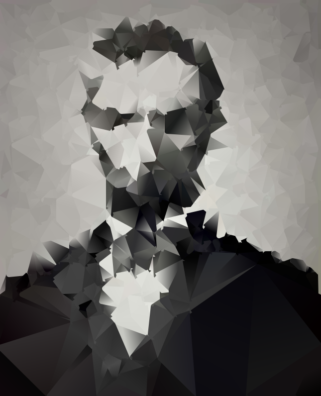
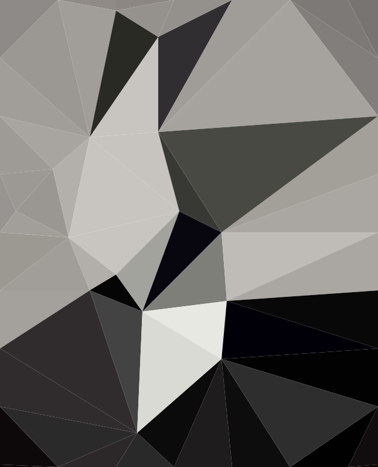
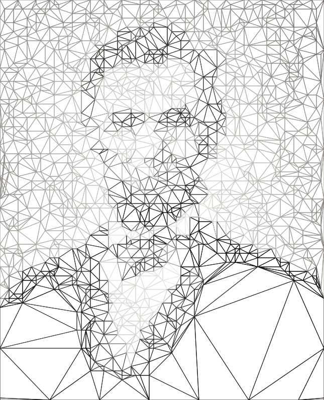
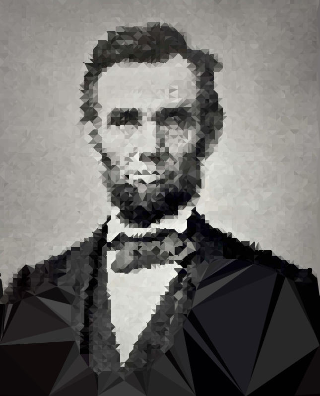
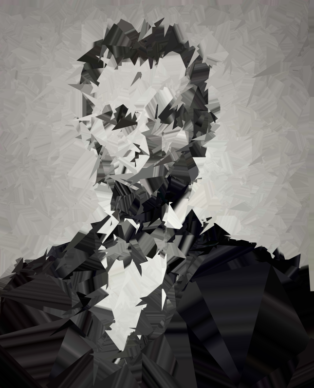
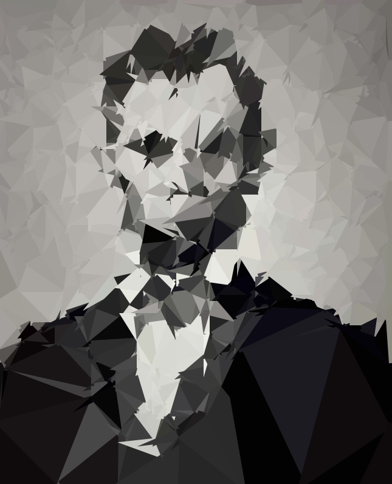

example images
===

gradients
---

```javascript
var params = {
	blur: 110,
	vertexCount: 700,
	accuracy: 0.2,
	fill: true,
	gradients: true,
	gradientStops: 2,
	stroke: true,
	strokeWidth: 10,
	lineJoin: 'round'
};
```

low poly
---

```javascript
var params = {
	blur: 110,
	vertexCount: 50,
	accuracy: 0.9,
	fill: true,
	gradients: false,
	gradientStops: 2,
	stroke: false,
	strokeWidth: 10,
	lineJoin: 'round'
};
```

outlines
---

```javascript
var params = {
	blur: 110,
	vertexCount: 1350,
	accuracy: 0.9,
	fill: false,
	gradients: false,
	gradientStops: 2,
	stroke: true,
	strokeWidth: 1,
	lineJoin: 'miter'
};
```

high poly
---

```javascript
var params = {
	blur: 110,
	vertexCount: 4350,
	accuracy: 0.9,
	fill: true,
	gradients: false,
	gradientStops: 2,
	stroke: true,
	strokeWidth: 2,
	lineJoin: 'miter'
};
```

broken mirror
---

```javascript
var params = {
	blur: 110,
	vertexCount: 650,
	accuracy: 0.5,
	fill: true,
	gradients: true,
	gradientStops: 20,
	stroke: true,
	strokeWidth: 15,
	lineJoin: 'miter'
};
```

lazy painter
---

```javascript
var params = {
	blur: 110,
	vertexCount: 650,
	accuracy: 0.5,
	fill: true,
	gradients: false,
	gradientStops: 2,
	stroke: true,
	strokeWidth: 10,
	lineJoin: 'miter'
};
```